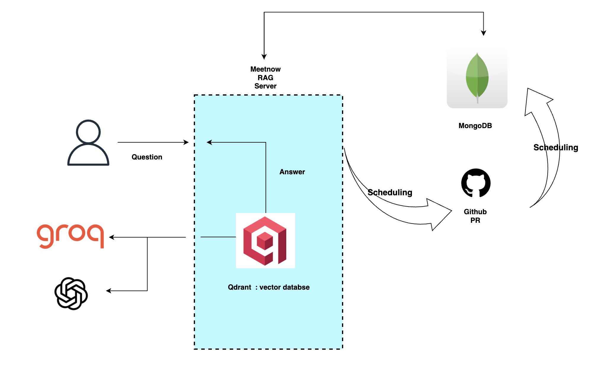

<!--# SpringAI

### Personal Practice Repo for SpringAI opensource contributions
swagger URI(simple api call) : http://localhost:8080/swagger-ui/index.html#

* [Ref. docs.spring.io/spring-ai](https://docs.spring.io/spring-ai/reference/api/chat/groq-chat.html)
* [WBS & accumulation of search for SpringAI](https://www.notion.so/spring-ai-255563c2bc86800ab7dbc566c63daf4d)
-->

# RAG 시스템 구축 : 채팅 연동 [meetnow](https://github.com/TimeTogether/TimeTogether-Backend-V2) 진행상황 확인 통합 시스템

